# Semen and Semantics: Understanding Porn with Language Embeddings

[Daniel Healy](https://www.linkedin.com/in/daniel-healy/)

## TLDR

- Porn content has gotten more extreme over time
- We can observe and quantify changes with language embeddings for video titles
- There are three distinct eras: 2008-2009, 2010-2016, 2017-
- We are close to semantic bedrock with respect to sexual violence: porn titles cannot become more sexually violent in their descriptions, because we lack the vocabulary
- My hope is that this analysis can be used as evidence and encouragement to limit porn access for minors

## Data and Methods

Download the repo and run "pip install" to install dependencies.

Pre-downloaded data is located in the "snapshots" folder. Pornhub data goes back to 2007, but analysis begins in 2008, when the format became more consistent. We have a folder for each month of the year, and a roughly weekly cadence of snapshots. For each date, there are two files, e.g.: "20080606.html", the raw HTML file,  and "20080606.json", which contains the parsed video titles. The JSON files is an array of dictionaries like so:

{
  "title": "Quickie on the car?",
  "url": "/view_video.php?viewkey=9aeff09be64077906196",
  "views": "39183",
  "duration": "7:39\n    \t7 hours ago",
  "embedding": ...
}

where the "embedding" field is the "title" value converted by OpenAI's "text-embedding-3-large". The URL format changes slightly over time.

From 4416 available snapshots, we end up with 772 weekly snapshots. Typically, we'll segregate these by year in order to form legible boundaries.

To download more data, run "fetch_snapshots.py" in the "data_retrieval" directory. You can change the website by editing the Python file.

To work with embeddings, you will need an OpenAI API key. Set it with export OPENAI_API_KEY={...}.

## Calculating Yearly Centroids

We calculate the representative porn for a year like so:

- Take the average embedding for each day
- Given each day's average embedding, take the average of those averages

This gives us the "centroid" which is our representative embedding for the year. We calculate the daily average first to moderate the impact of changes within the year.

## Centroid Similarity

We'll start by looking at how different each centroid is to every other centroid, as seen below:

| |
|---------|
| 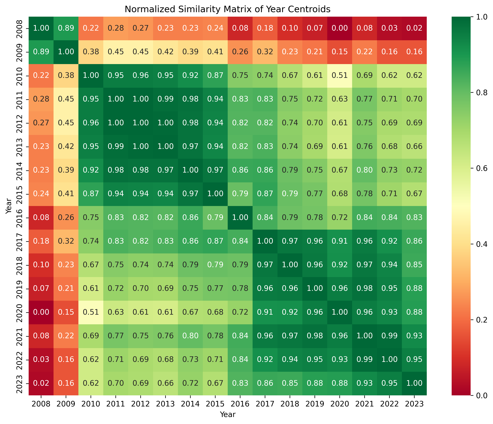 |

We see 3 periods emerging: 2008-2009, 2010-2016, and 2017-2023.

Run "run_centroids" to reproduce.

## Centroid Clusters

We can do the same thing with t-SNE:

| |
|---------|
| 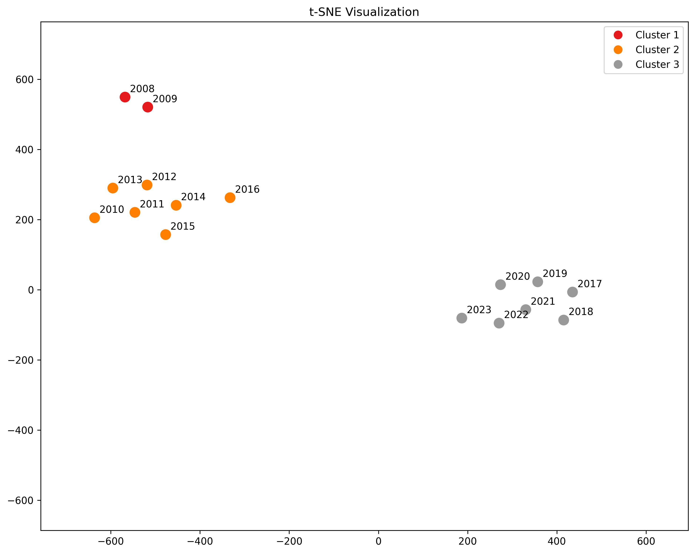 |

The trends are similar to what we see in the heatmap: 2008 and 2009 are close, but not quite part of, the 2010-2016 cluster, and we see 2016 starting to edge away from its cluster mates. There have been at least two distinct epochs of video titling conventions in Pornhub's history.

## Centroid Titles

Consequently, to find the representative video title for the year, we can take the centroid, and find its nearest neighbor for the given year - out of the titles for say, 2010, which is the closest to "average"? They are as follows:

- 2008: Hot blonde girl gets fucke...
- 2009: Big tit blonde fuckslut na...
- 2010: Latina starlet pounded hard
- 2011: Hot brunette experiences anal
- 2012: Big breasted anal fuck in a garage
- 2013: Big Boobed Brunette Fucked
- 2014: Jessica Jaymes POV
- 2015: Hot Anal Madison
- 2016: MyBabySittersClub - Blonde Teen Babysitter Helps Me Cum
- 2017: Big Tits Blasian Teen Anal Creampie Casting
- 2018: Stuffed MILF creams all over My cock 4K **PAWG** [FULL VID]
- 2019: BEAUTIFUL BUSTY TEEN LOVES A HARD DICK - HARD FUCKING VOL 2
- 2020: Slutty Daughter Sends You A Video From Her Dorm
- 2021: Hot College Babe Fingered And Fucked ROUGH To Multiple Orgasms - BLEACHED RAW - Ep IX
- 2022: Rough Fuck & Creampie
- 2023: FAMILYXXX - "I Cant Resist My Stepsis Big Juicy Ass" (Mila Monet)

This sheds some light on our previous findings:

- 2008 and 2009 may in fact just be distinct because of their truncation: the ellipse indicates that the Pornhub snapshot at that time only stored a certain number of characters.
- The earlier titles seem to be shorter and less descriptive, focusing on certain qualities: we see mentions of hair color multiple times ("blonde", "blonde", "brunette") and anal sex ("anal", "anal fuck", "Hot Anal").
- Later titles are longer, and we start to observe a trend towards both incest ("Daughter", "Stepsis") and violence ("HARD FUCKING", "Fucked ROUGH", "Rough Fuck").
- Note that capitalization practices have also changed, which seems to have started a bit earlier, in 2013.

Run "run_nearest_neighbors" to reproduce; increase the value for K (the number of neighbors) to see more titles.

These results are informative but not conclusive. Let's observe trends.

## Keyword Trends

We can observe keyword trends like so:

1. We create a reference embedding, like "latina"
2. We get the cosine similarity of the reference against every title in our dataset
3. We convert the raw similarity into a normalized z score
4. We take the top 10% most similar scores from the whole set
5. We count how many of the top 10% scores are in each year
6. We adjust for the number of titles in each year - if 2010 only has 100 titles and 2020 has 200, as a baseline we'd expect 2010 to have 10 relevant examples and 2020 to have 20

If we do this for e.g. "latina" we get:

| Year | Matches | Total | Rate | Normalized |
|------|---------|-------|------|------------|
| 2008 | 18      | 114   | 0.158| 1.58x      |
| 2009 | 18      | 126   | 0.143| 1.43x      |
| 2010 | 12      | 126   | 0.095| 0.95x      |
| 2011 | 33      | 258   | 0.128| 1.28x      |
| 2012 | 36      | 312   | 0.115| 1.16x      |
| 2013 | 40      | 306   | 0.131| 1.31x      |
| 2014 | 29      | 306   | 0.095| 0.95x      |
| 2015 | 43      | 306   | 0.141| 1.41x      |
| 2016 | 15      | 282   | 0.053| 0.53x      |
| 2017 | 41      | 294   | 0.139| 1.40x      |
| 2018 | 27      | 264   | 0.102| 1.02x      |
| 2019 | 14      | 264   | 0.053| 0.53x      |
| 2020 | 18      | 288   | 0.062| 0.63x      |
| 2021 | 27      | 306   | 0.088| 0.88x      |
| 2022 | 18      | 312   | 0.058| 0.58x      |
| 2023 | 26      | 294   | 0.088| 0.89x      |

which looks like this:

| |
|---------|
| 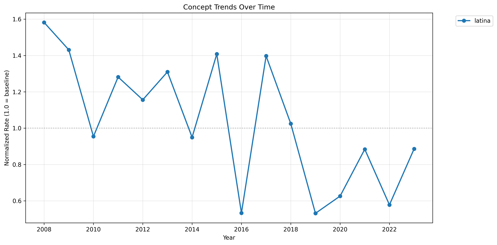 |

"latina" as a descriptor here has lost marketshare over time.

As a mild control, let's look at the word "orthogonal", which should probably be unrelated.

| |
|---------|
| 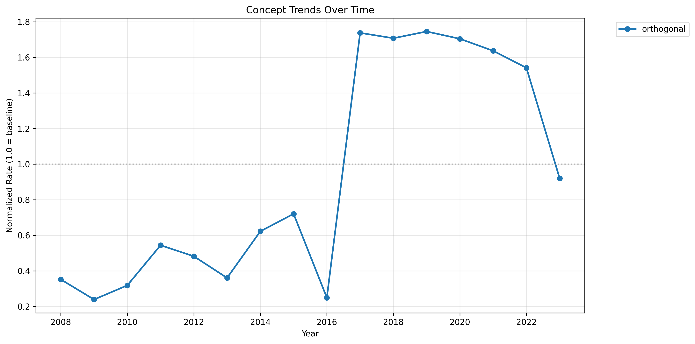 |

The 2016 jump might indicate the general increase in complexity of titles around that time. This mirrors what we see with the clusters, where 2016 was a transitional year.

Finally, let's take a look at the sexual violence trends, with incest and rape:

| |
|---------|
| 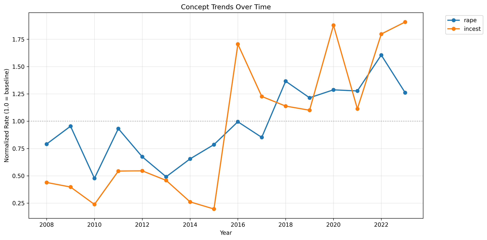 |

For both, an obvious jump and sustained increase. Incest is outperforming rape, as we can observe from the "step-" titles and their variants.

Run "run_trend" with an array of words of your choice to run your own analysis.

## t-SNE Clusters

We'll return to t-SNE to take a closer look at some new clusters. Similar to our keywords, we create reference embeddings. This time, I made category groups of three, intended to cluster together, in order to see how categories relate to our early and late stage time periods. We can take distance of cluster as similarity.

### Haircolor

"brunette", "blonde", "redhead"

| |
|---------|
| 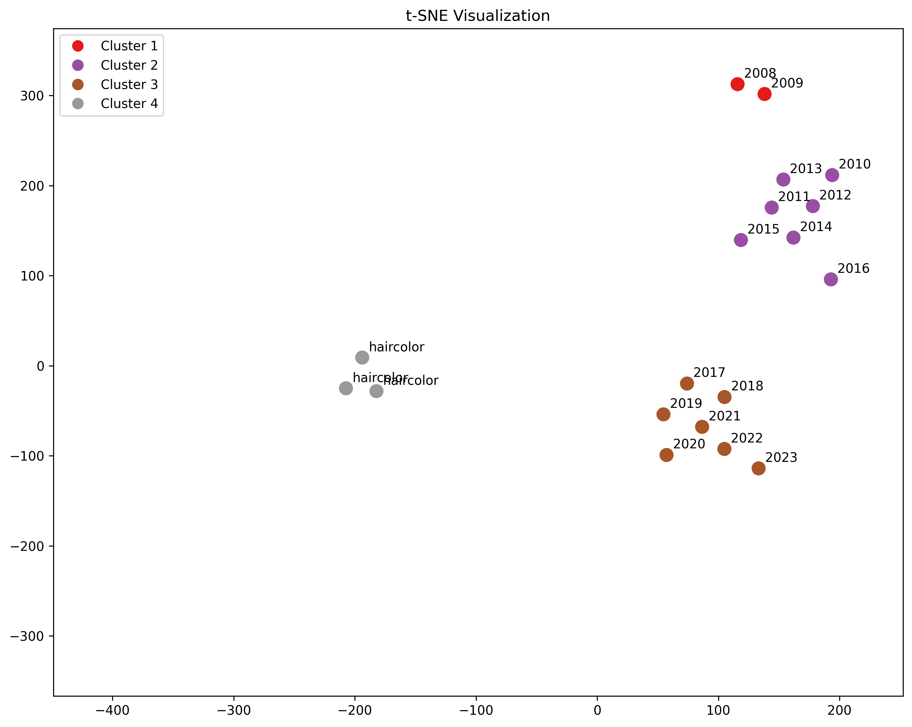 |

Observing that hair color comes up frequently in early period titles, we include some here, but we see that they are not particularly close to either cluster of centroids.

### Pornstar Names

"Maximus Thrust", "Ivana Delight", "Johnny Deep" (fictional names courtesy of ChatGPT)

| |
|---------|
| 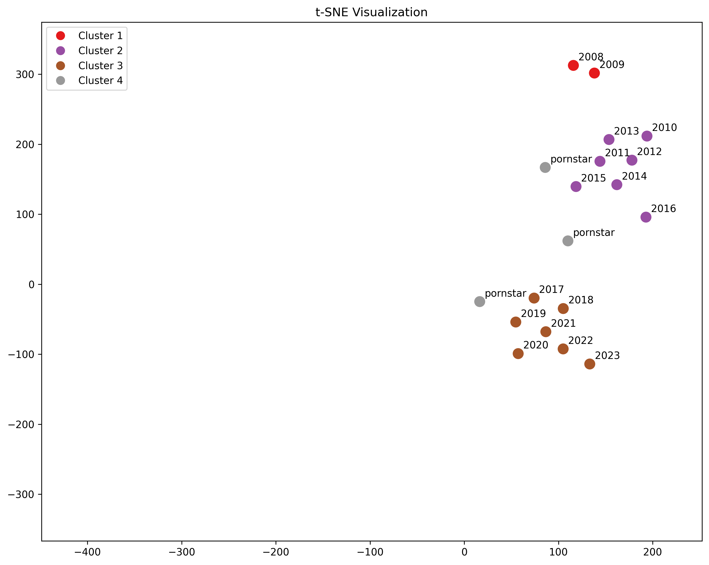 |

Porn star names are more similar to the early years, but we observe proximity to the late period as well.

### Violence

"murder", "suicide", "death"

| |
|---------|
| 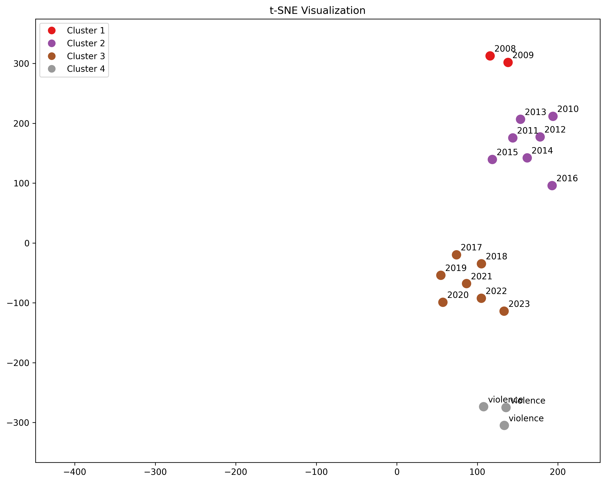 |

Violence forms its own cluster. Possibly, titles are trending towards violence over time.

### Women

"woman dancing", "woman cooking", "woman eating breakfast"

| |
|---------|
| 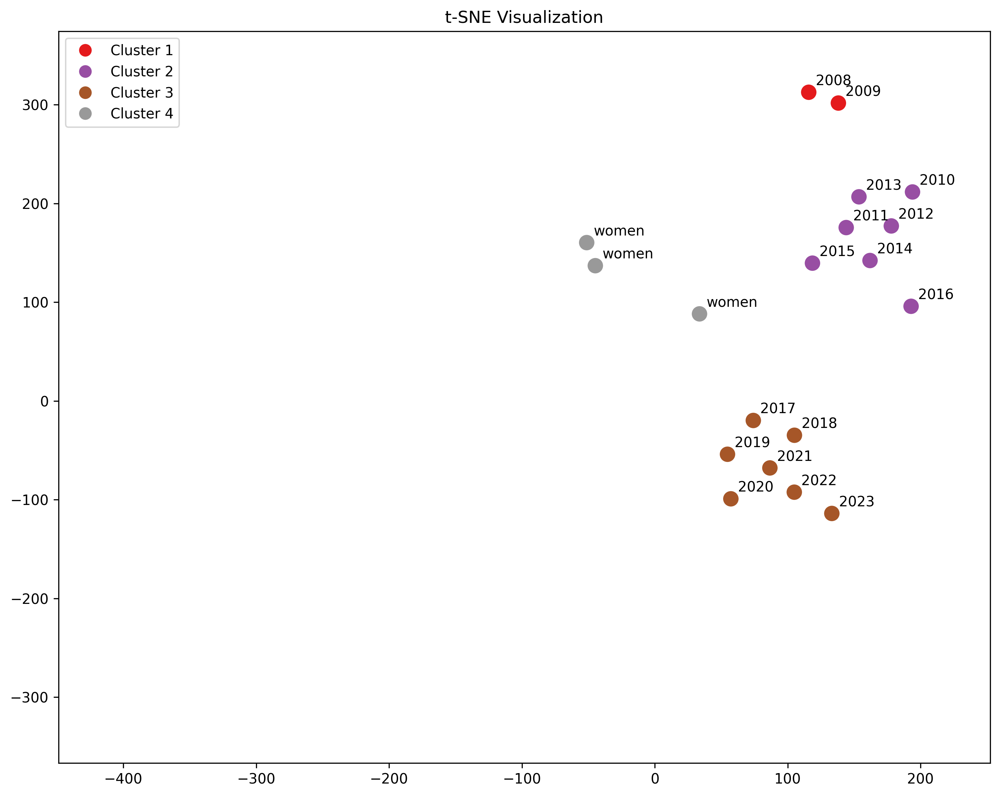 |

"Women doing activity" is a common format for titles and we observe some proximity here.

### Men

"men digging ditches", "men lighting laterns", "men hiking the hills"

| |
|---------|
| 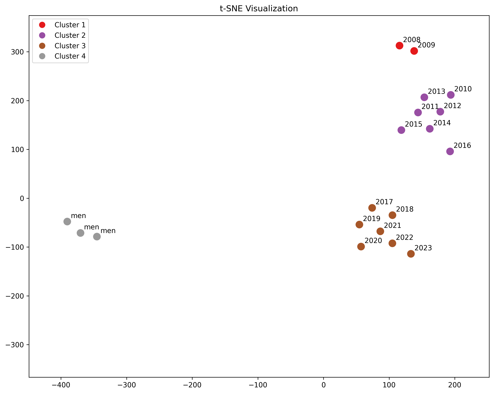 |

Men is much further away; we may infer that the subject performing the action is less relevant than the subject receiving it.

### Racial

"african american", "latino", "asian"

| |
|---------|
| 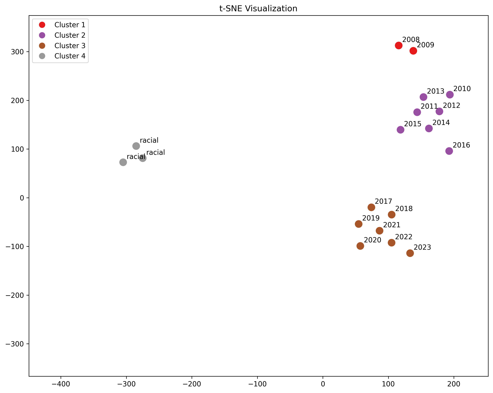 |

Racial categories are a bit closer than men, since they are commonly included.

### Manufacturing

"airplane factory", "blue collar", "manufacturing"

| |
|---------|
| 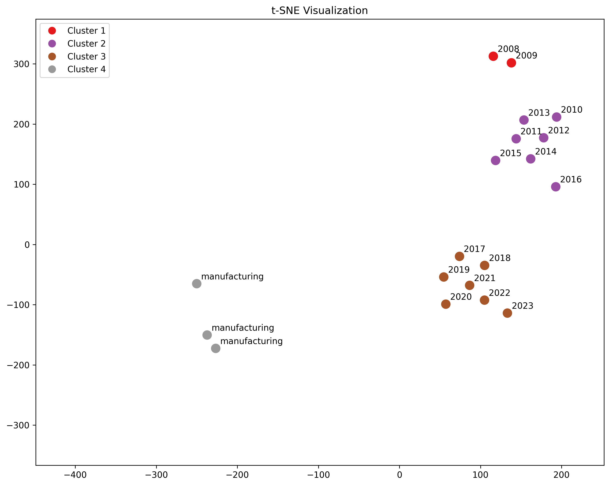 |

"Manufacturing" is meant as a pure control, unrelated to sex in general. But it's actually somewhat closer than men or racial groups.

### Benign

"people in love", "healthy relationships", "moral behavior"

| |
|---------|
| 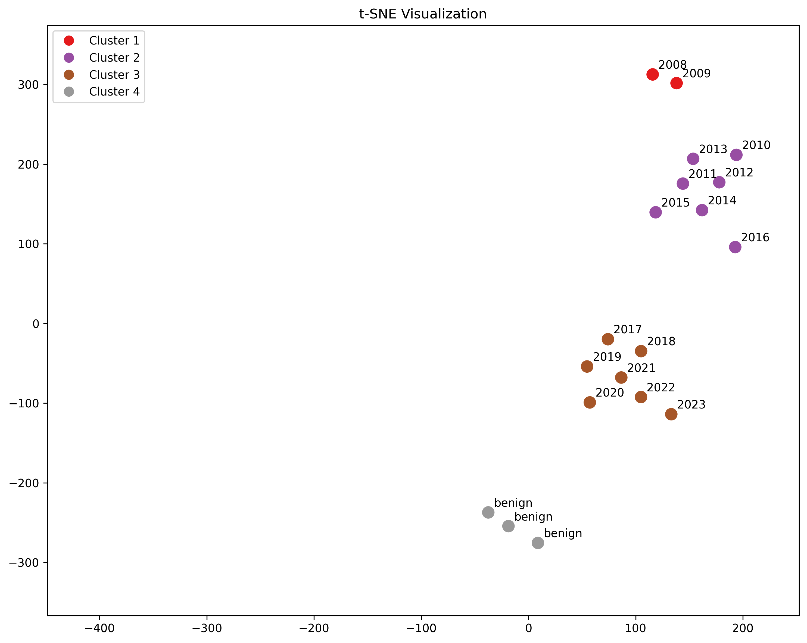 |

The benign terms are meant to offer a contrast to the sexual violence. They actually are relatively close, and along the same chronological trend as violence.

### Sexual Violence

"woman being raped", "incest", "torture porn"

| |
|---------|
| 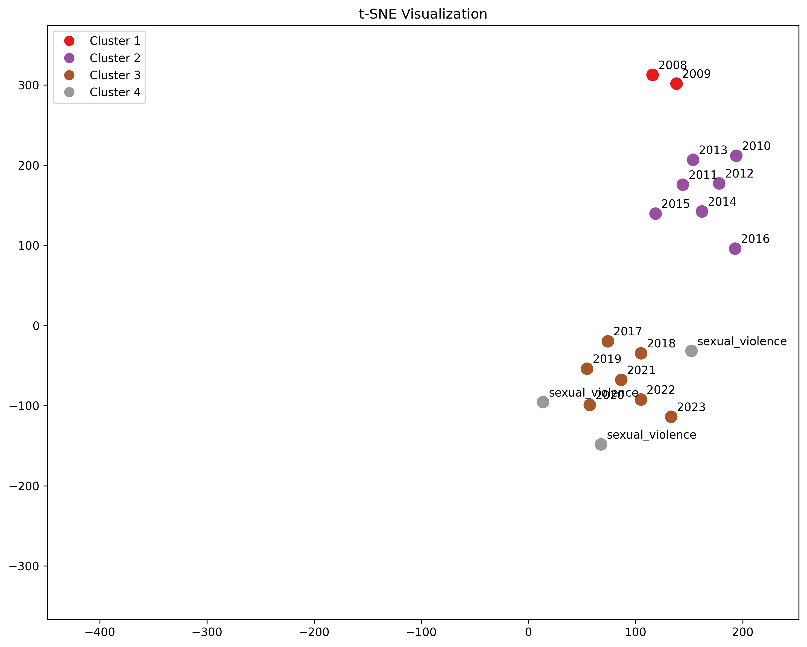 |

We observe a direct hit. Our sexually violent terms almost completely overlapping our late period titles: the two have become synonymous.

Here they are all at once:

| |
|---------|
| 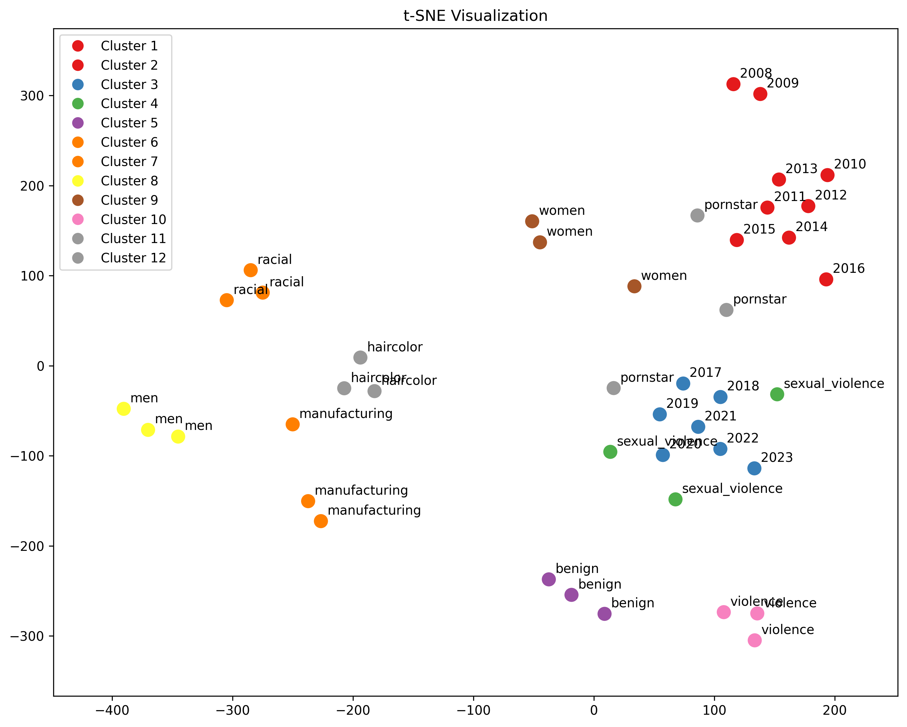 |

Run "run_tsne" to visualize your own reference groups. By default, the script will first generate the mappings, and then show:

1. The mapped years
2. The mapped years with each concept cluster individually
3. Every cluster and the mapped years

## Conclusions

Some of the effects are pure SEO - videos are labeled with sexually violent language, even if they are not themselves *actually* sexually violent. But the total trend reflects the actual video contents, which have become more intense to cater to more intense tastes of the highest spending, most engaged consumers.

Broadly this is because of professionalization: a shift from amateur, Youtube-style porn to professional studios with an interest in the bottom line. Interestingly, this mimics the evolution of Youtube itself as well. A broad, internet-wide shift towards monetization might be benign elsewhere, but in the porn domain, becomes a race to the bottom of sexual violence.

Political efforts may have contributed to locking in some aspects of this monetization trend. FOSTA-SESTA and sundry efforts by payment processors to limit porn exposure probably helped improve the conditions of the supply side and prevented videos of minors, rape from being uploaded. That's good! But it created an unintended consequence at the expense of the demand side: professional studios started to emphasize youth and violence.

The real losers here are adolescents exposed to porn at an early age. I'm generally skeptical of regulation for what adults can see, but I can't think of a good reason not to mandate a porn paywall - call it a porn tax - and thereby restrict access to credit card or bank account holders, a de facto age limit more effective than existing legislation.

For a longer editorial, see [here](https://www.example.com).

## Further Work

TODO:

- Analyze trends by "minutes watched" by weighting for views, view X length; this is more likely a heuristic for content production than actual viewing time
